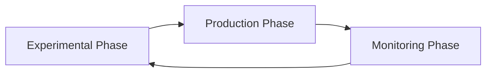

# Introduction to MLOps

[](https://ml-ops.org/)
[]()
[]()

> **Comprehensive guide to Machine Learning Operations (MLOps) - from fundamentals to production deployment**

## Table of Contents

- [What is MLOps?](#what-is-mlops)
- [Why MLOps?](#why-mlops)
- [MLOps Lifecycle](#mlops-lifecycle)
- [Core Principles](#core-principles)
- [Maturity Levels](#maturity-levels)
- [Key Components](#key-components)
- [Tools and Technologies](#tools-and-technologies)
- [Best Practices](#best-practices)
- [Common Challenges](#common-challenges)
- [Resources](#resources)
- [Contributing](#contributing)

---

## What is MLOps?

**MLOps (Machine Learning Operations)** is a set of practices that combines Machine Learning, DevOps, and Data Engineering to deploy and maintain ML models in production reliably and efficiently.

### Key Definition

> MLOps applies DevOps principles to machine learning projects, automating and streamlining the end-to-end machine learning lifecycle—from data collection and model training to deployment, monitoring, and continuous improvement.

### Core Objectives

- 🚀 **Accelerate** time-to-market for ML models
- 🔄 **Automate** the ML pipeline from development to production
- 📊 **Monitor** model performance and detect drift
- 🔧 **Maintain** models with continuous training and updates
- 🤝 **Collaborate** across data science, engineering, and operations teams

---

## Why MLOps?

### The Problem

According to recent research, many ML initiatives fail to reach production due to:

- **Lack of reproducibility** in experiments and training
- **Data and model drift** causing performance degradation
- **Scalability challenges** when moving from prototype to production
- **Collaboration gaps** between data scientists and operations teams
- **Governance and compliance** concerns in regulated industries

### The Solution

MLOps provides:

✅ **Reproducibility**: Version control for code, data, and models  
✅ **Automation**: CI/CD pipelines for ML workflows  
✅ **Monitoring**: Real-time tracking of model performance  
✅ **Governance**: Audit trails and compliance frameworks  
✅ **Scalability**: Infrastructure to handle production workloads  

### Business Impact

- **70% of enterprises** will operationalize AI using MLOps by 2025 (Gartner)
- **60% reduction** in inference costs through automation
- **10x faster** experimentation and deployment cycles
- **30% cost savings** through optimized resource utilization

---

## MLOps Lifecycle

The MLOps lifecycle consists of three interconnected phases:



### 1. Experimental Phase (Design & Development)

**Focus**: Model development and experimentation

- **Data Collection**: Gather data from various sources
- **Data Preparation**: Clean, validate, and preprocess data
- **Feature Engineering**: Create meaningful features
- **Model Training**: Experiment with algorithms and architectures
- **Model Evaluation**: Assess performance on validation data

**Tools**: Jupyter Notebooks, pandas, scikit-learn, TensorFlow, PyTorch

### 2. Production Phase (Deployment & Operations)

**Focus**: Model deployment and serving

- **Model Packaging**: Containerize with Docker/Kubernetes
- **Deployment Pipelines**: Automate promotion to production
- **Model Serving**: Set up APIs for inference
- **A/B Testing**: Compare models in production
- **Scaling**: Handle production traffic

**Tools**: Docker, Kubernetes, Seldon Core, BentoML, cloud platforms

### 3. Monitoring Phase (Continuous Improvement)

**Focus**: Performance tracking and maintenance

- **Performance Monitoring**: Track accuracy, latency, throughput
- **Drift Detection**: Identify data and model drift
- **Alerting**: Notify teams of issues
- **Retraining**: Update models with fresh data
- **Feedback Loop**: Incorporate production insights

**Tools**: Prometheus, Grafana, Evidently AI, custom monitoring solutions

---

## Core Principles

MLOps extends DevOps with four fundamental principles:

### 🔄 Continuous Integration (CI)

- Automated testing of code, data schemas, and models
- Version control for all ML assets
- Integration of new features and improvements

### 🚀 Continuous Delivery/Deployment (CD)

- Automated deployment of ML pipelines
- Seamless promotion from staging to production
- Infrastructure as Code (IaC)

### 📚 Continuous Training (CT)

*Unique to MLOps*

- Automatic retraining with new data
- Scheduled or trigger-based updates
- Maintaining model relevance over time

### 📊 Continuous Monitoring (CM)

- Real-time performance tracking
- Data quality monitoring
- System health and resource utilization

---

## Maturity Levels

Organizations progress through different MLOps maturity levels:

### Level 0: Manual Process

```
Characteristics:
├── All steps are manual
├── Notebook-driven development
├── Infrequent releases (2-4 times/year)
├── No CI/CD
└── Limited monitoring
```

**When appropriate**: Proof-of-concept projects, one-off analyses

### Level 1: ML Pipeline Automation

```
Characteristics:
├── Automated ML pipelines
├── Rapid experimentation
├── Continuous training
├── Model registry
└── Some manual deployment steps
```

**When appropriate**: Teams with multiple models, regular updates needed

### Level 2: CI/CD Pipeline Automation

```
Characteristics:
├── Fully automated MLOps
├── Complete CI/CD/CT pipeline
├── Advanced monitoring
├── Drift detection and auto-retraining
└── Comprehensive governance
```

**When appropriate**: Enterprise-scale ML systems, regulated industries

---

## Key Components

### 1. Data Management

**Purpose**: Version and track datasets

```yaml
Tools:
  - DVC: Git-style data versioning
  - Pachyderm: Data lineage tracking
  - Delta Lake: ACID transactions for data lakes
```

### 2. Experiment Tracking

**Purpose**: Log and compare ML experiments

```yaml
Tools:
  - MLflow: Open-source experiment tracking
  - Weights & Biases: Real-time collaboration
  - Neptune.ai: Metadata management
```

### 3. Model Registry

**Purpose**: Centralized model storage and versioning

```yaml
Tools:
  - MLflow Model Registry: Version control for models
  - AWS SageMaker Model Registry: Cloud-native solution
  - Azure ML Model Registry: Enterprise governance
```

### 4. Feature Store

**Purpose**: Reusable feature repository

```yaml
Tools:
  - Feast: Open-source feature store
  - Tecton: Enterprise feature platform
  - Databricks Feature Store: Unified with data platform
```

### 5. Pipeline Orchestration

**Purpose**: Automate ML workflows

```yaml
Tools:
  - Kubeflow: Kubernetes-native ML pipelines
  - Apache Airflow: DAG-based orchestration
  - TFX: End-to-end TensorFlow pipelines
  - ZenML: Modern, modular framework
```

### 6. Model Serving

**Purpose**: Deploy models as services

```yaml
Tools:
  - Seldon Core: Kubernetes model serving
  - BentoML: Model serving framework
  - TorchServe: PyTorch models
  - Cloud platforms: SageMaker, Azure ML, Vertex AI
```

### 7. Monitoring & Observability

**Purpose**: Track performance and detect issues

```yaml
Tools:
  - Evidently AI: Drift detection
  - Prometheus + Grafana: Metrics visualization
  - Arize AI: ML observability
  - Datadog: Full-stack monitoring
```

---

## Tools and Technologies

### Open-Source Ecosystem

| Category | Popular Tools |
|----------|--------------|
| **End-to-End Platforms** | MLflow, Kubeflow, ZenML |
| **Experiment Tracking** | MLflow, Weights & Biases, Neptune.ai |
| **Data Versioning** | DVC, Pachyderm, lakeFS |
| **Orchestration** | Apache Airflow, Prefect, Dagster |
| **Model Serving** | Seldon Core, BentoML, KServe |
| **Monitoring** | Evidently AI, Prometheus, Grafana |

### Cloud Platforms

| Provider | Platform | Strengths |
|----------|----------|-----------|
| **AWS** | SageMaker | Deepest cloud integration, 34% market share |
| **Azure** | Azure ML | Enterprise governance, regulated industries |
| **Google Cloud** | Vertex AI | AutoML, petabyte-scale training |

### Getting Started Stack

For beginners, we recommend:

```yaml
Minimal Stack:
  - Experiment Tracking: MLflow
  - Version Control: Git + DVC
  - Orchestration: Apache Airflow
  - Containerization: Docker
  - Monitoring: Prometheus + Grafana
```

---

## Best Practices

### 1. 🤖 Automate Everything

- Build CI/CD pipelines for ML workflows
- Automate data validation and model testing
- Use Infrastructure as Code (Terraform, CloudFormation)

### 2. 📝 Version Control All Assets

```bash
# Version code
git commit -m "Update feature engineering"

# Version data
dvc add data/training_data.csv
dvc push

# Version models
mlflow log_model(model, "model")
```

### 3. 🧪 Implement Robust Testing

- **Data validation**: Schema checks, distribution validation
- **Model validation**: Performance on holdout sets
- **Integration testing**: End-to-end pipeline validation
- **A/B testing**: Compare models in production

### 4. 📊 Monitor Continuously

```python
# Example monitoring setup
monitor = ModelMonitor(
    model=deployed_model,
    metrics=['accuracy', 'latency', 'throughput'],
    drift_detection=True,
    alert_threshold=0.05
)
```

### 5. 🔄 Design for Reproducibility

- Use containers (Docker, Kubernetes)
- Pin dependencies explicitly
- Track random seeds and initialization
- Maintain comprehensive metadata

### 6. 🤝 Foster Collaboration

- Shared platforms and documentation
- Cross-functional MLOps teams
- Clear handoff processes
- Regular sync meetings

### 7. 📈 Start Simple, Scale Gradually

1. Begin with basic version control
2. Add experiment tracking
3. Automate repetitive tasks
4. Implement CI/CD pipelines
5. Add advanced monitoring

### 8. 📚 Document Everything

- Model cards (purpose, limitations, performance)
- Data cards (sources, preprocessing, quality)
- Architecture diagrams
- Runbooks for operations

---

## Common Challenges

### Challenge 1: Model Drift

**Problem**: Models degrade as data distributions change

**Solutions**:
- Implement drift detection (Evidently AI, custom solutions)
- Set up automated retraining pipelines
- Use ensemble models for robustness
- Maintain feedback loops from production

### Challenge 2: Reproducibility

**Problem**: Difficulty recreating training results

**Solutions**:
- Version all assets (code, data, configs, models)
- Use containerization (Docker)
- Track complete lineage
- Fix random seeds for determinism

### Challenge 3: Scaling

**Problem**: Production workloads exceed development capacity

**Solutions**:
- Design for horizontal scalability
- Use auto-scaling infrastructure (Kubernetes)
- Implement caching and batch processing
- Optimize bottlenecks based on monitoring

### Challenge 4: Tool Complexity

**Problem**: Too many tools create integration challenges

**Solutions**:
- Start with minimal, integrated toolset
- Choose tools with strong community support
- Standardize across teams
- Prioritize platforms with multiple capabilities

---

## Resources

### 📖 Documentation

- [MLOps.org](https://ml-ops.org/) - Community-driven MLOps resources
- [Google Cloud MLOps Guide](https://cloud.google.com/architecture/mlops-continuous-delivery-and-automation-pipelines-in-machine-learning)
- [Microsoft Azure MLOps](https://learn.microsoft.com/en-us/azure/machine-learning/concept-model-management-and-deployment)
- [AWS MLOps](https://aws.amazon.com/sagemaker/mlops/)

### 📚 Research Papers

- ["Machine Learning Operations: Overview, Definition, and Architecture"](https://arxiv.org/abs/2205.02302)
- ["MLOps Spanning Whole Machine Learning Life Cycle"](https://arxiv.org/abs/2304.07296)
- ["Navigating MLOps: Insights into Maturity, Lifecycle, Tools, and Careers"](https://arxiv.org/abs/2503.15577)

### 🛠️ Tools

- [MLflow](https://mlflow.org/) - Experiment tracking and model registry
- [Kubeflow](https://www.kubeflow.org/) - Kubernetes-native ML workflows
- [DVC](https://dvc.org/) - Data version control
- [Evidently AI](https://evidentlyai.com/) - ML monitoring and drift detection

### 🎓 Courses and Tutorials

- [Made With ML - MLOps Course](https://madewithml.com/)
- [Full Stack Deep Learning](https://fullstackdeeplearning.com/)
- [Coursera - MLOps Specialization](https://www.coursera.org/specializations/machine-learning-engineering-for-production-mlops)

---

## Credits and Acknowledgments

This guide synthesizes insights from multiple authoritative sources:

**Research Community**:
- arXiv MLOps research papers
- Academic publications on ML lifecycle management

**Industry Leaders**:
- Google Cloud MLOps documentation
- Microsoft Azure ML best practices
- AWS MLOps guides
- Databricks MLOps resources

**Open-Source Community**:
- MLOps.org principles and guidelines
- MLflow, Kubeflow, and other tool documentation
- neptune.ai and Evidently AI resources

**Special Thanks**:
- The MLOps community for democratizing ML operations practices
- Contributors to open-source MLOps tools
- Researchers advancing the field of production ML

---

## License

This project is licensed under the MIT License - see the LICENSE file for details.

---

**⭐ If you find this guide helpful, please consider giving it a star!**

*Last updated: October 2025*
